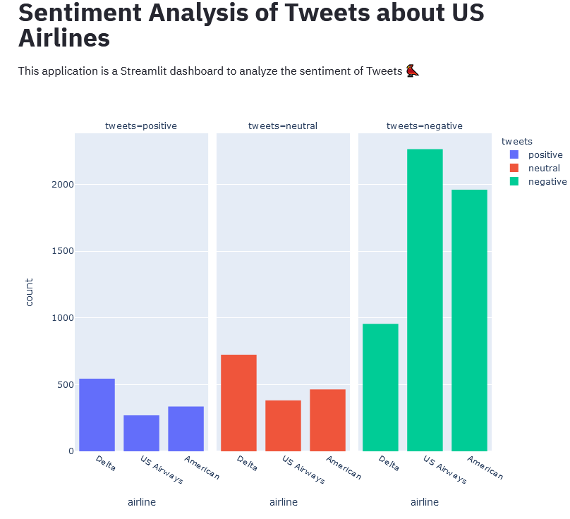
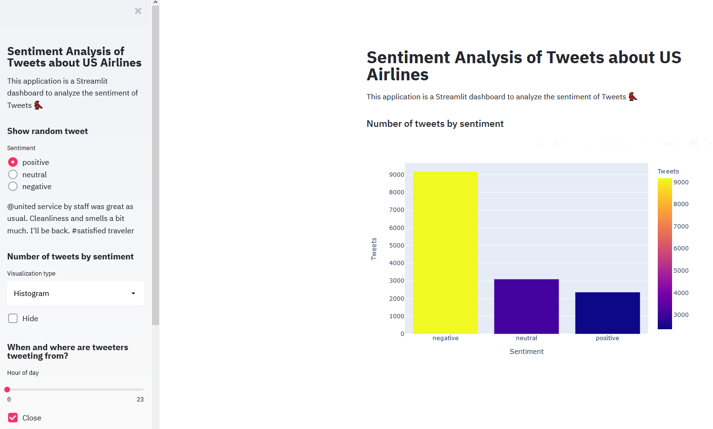
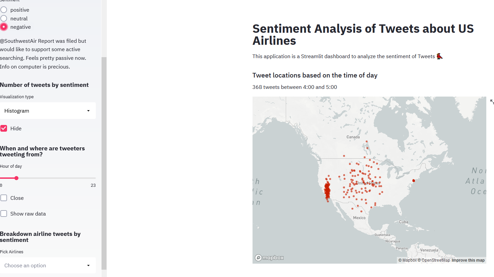
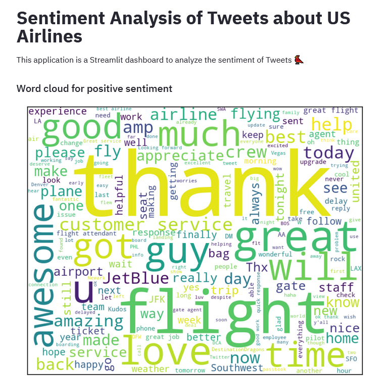

# Visualization of US Airline Tweets using Streamlit

#### -- Project Status: [Completed]

## Project Intro/Objective
The purpose of this project is design a visualization application that would allow the end-users to quickly understand customer opinions about them using data from Twitter.

### Methods Used
* Web Deployment
* Data Visualization
* Customer Satisfaction
* etc.

### Technologies
* Python, Markdown
* Streamlit
* Pandas, numpy matplotlib, seaborn
* HTML
* Jupyter
* etc. 

## Project Description
The data used on this project already has sentiment analysis done on it. The data was used from [Kaggle](https://www.kaggle.com/crowdflower/twitter-airline-sentiment). The data comprises of number of tweets, each with a sentiment and airline associated with it. Each tweet also contains the latitude and longitude information for location tracking. The mail goal of this project is to learn web application deployment using [Streamlit](https://www.streamlit.io/). Streamlit is a new tool that allows data enthusiasts to quickly convert a python script into neat and fast web applications involving machine learning, data analytics and pretty much anything. 

This tool is build with the end-client in mind and has been designed in a way that would allow various customizability and usability across different features. Below, you will see some of the main features and highlights from this project.

## Highlights of the Project

- As mentioned above, the application has a lot of cool features to increase productivity. Some examples of these features are shown below.

- The end-user can also sort the tweets by different hours of day to analyze the trend of when people are the most active. 

- Lastly, the end-client can try to highlight the most focused words by the customers for different sentiments. This can help them improve their services if they know which areas are affecting the customers the most.

## Running the Application on Local Machine

1. Clone this repo (for help see this [tutorial](https://help.github.com/articles/cloning-a-repository/)).
2. Open the terminal and navigate to the repo in your local computer
3. Make sure that streamlit is already installed. Then run 'streamlit run app.py'
4. This should deploy the application in a browser window. Feel free to explore and try it out.

## Featured Notebooks/Analysis
* [Notebook](data_visualization.ipynb)
* [Application](app.py)

